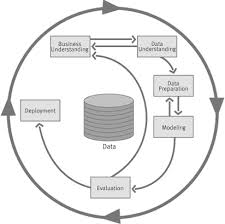

# CH 2 | Business Problems and Data Science Solutions

### Fundamental Concepts

* A set of canonical data mining tasks
* The data mining process
* Supervised versus unsupervised data mining

### Data Mining Tasks

| Task  | Description  | Type  |
|---|---|---|
| 1. Classification | **Whether** something happens | Supervised |
| 2. Regression | **How Much** something happens| Supervised |
| 3. Similarity Matching | **Identify** similar individuals| Either |
| 4. Clustering | **Group** similar individuals| Unsupervised |
| 5. Co-oocurrance Grouping | **Associate** or **Recommend** items| Unsupervised |
| 6. Profiling | **Characterize** individuals| Unsupervised |
| 7. Link Prediction | **Connect** items| Either |
| 8. Data Reduction | **Distill** data| Either |
| 9. Causal Modeling | Understand items that **influence** others| Either |


### Data Mining and Its Results

```
        Historical Data
               |
New Data --> Model --> Output 
```

* A model is built from historical data
* New data is fed into the model, producing an output
* The output depends on the model type (i.e. "True" or "779")


### CRISP-DM

