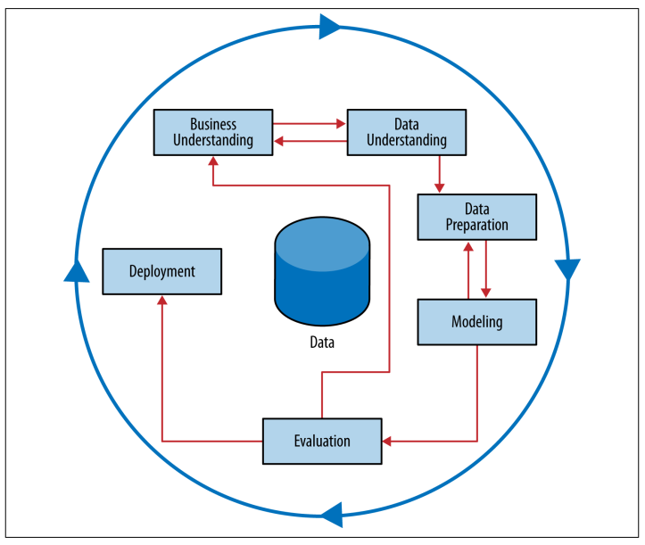

# CH 2 | Business Problems and Data Science Solutions

### Fundamental Concepts

* A set of canonical data mining tasks
* The data mining process
* Supervised versus unsupervised data mining

### Data Mining Tasks

| Task                      | Description                                | Type         |
| ------------------------- | ------------------------------------------ | ------------ |
| 1. Classification         | **Whether** something happens              | Supervised   |
| 2. Regression             | **How Much** something happens             | Supervised   |
| 3. Similarity Matching    | **Identify** similar individuals           | Either       |
| 4. Clustering             | **Group** similar individuals              | Unsupervised |
| 5. Co-oocurrance Grouping | **Associate** or **Recommend** items       | Unsupervised |
| 6. Profiling              | **Characterize** individuals               | Unsupervised |
| 7. Link Prediction        | **Connect** items                          | Either       |
| 8. Data Reduction         | **Distill** data                           | Either       |
| 9. Causal Modeling        | Understand items that **influence** others | Either       |


### Data Mining and Its Results

```
        Historical Data
               |
New Data --> Model --> Output 
```

* A model is built from historical data
* New data is fed into the model, producing an output
* The output depends on the model type (i.e. "True" or "779")


### CRISP-DM



| Step                   | Description                                                                    |
| ---------------------- | ------------------------------------------------------------------------------ |
| Business Understanding | Formulate the process/use case, map the problem to data science tools, iterate |
| Data Understanding     | Assess data sources for strengths and weaknesses                               |
| Data Preparation       | Clean and restructure data to match use                                        |
| Modeling               | Build a tool that outputs useful information                                   |
| Evaulation             | Determine efficacy and explain usage to others                                 |
| Deployment             | Monitor outputs, refine the system, and apply results                          |


### Other Analytics Techniques and Technologies

| Tool                | Description                                                                            |
| ------------------- | -------------------------------------------------------------------------------------- |
| Statistics          | Descriptive and inferential                                                            |
| Database Querying   | Efficient data access                                                                  |
| Data Warehousing    | Efficient data storage across multiple databases                                       |
| Regression Analysis | Extension of descriptive/inferential statistics                                        |
| ML & Data Mining    | Machine Learning is a seperate but related discipline; emphasizes cognition and agency |


### Summary

* Data Science is a craft, and comes with its own tools
* The CRISP-DM Model outlines a standard approach for mapping business problems to Data Science tools

