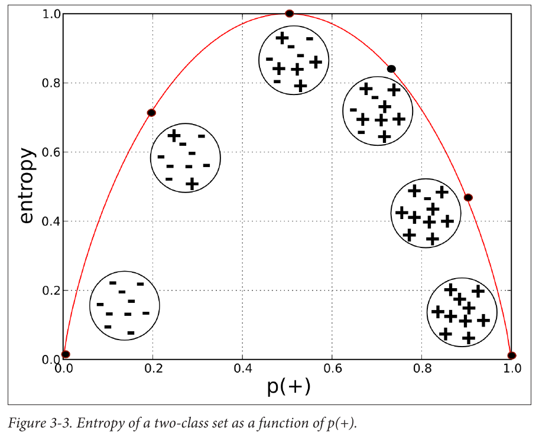
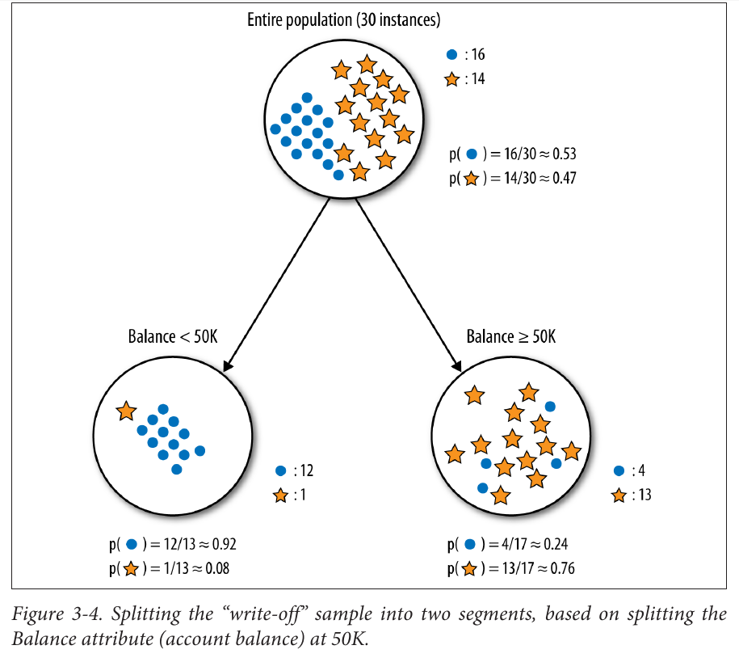
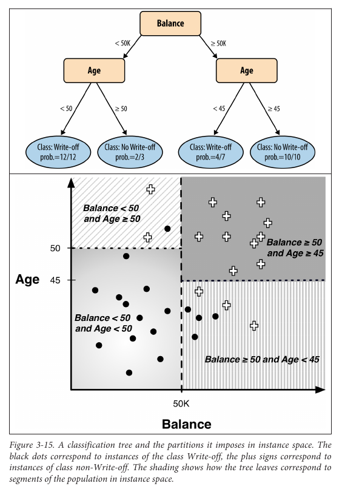
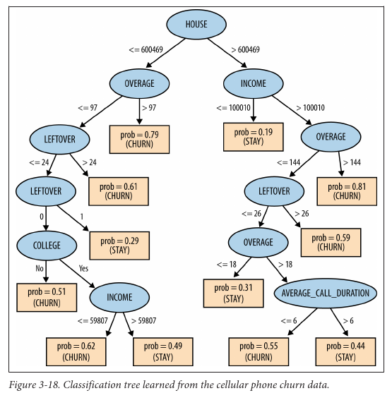

# CH 3 | Introduction to Predictive Modeling: From Correlation to Supervised Segmentation

### Fundamental Concepts

* Identifying informative attributes
* Segmenting data by progressive attribute selection

### Exemplary Techniques

* Finding correlations
* Attribute/variable selection
* Tree induction

### Models, Induction, and Precision

> "Information is a quality that reduces uncertainty."

| Term                  | Description                                   |
| --------------------- | --------------------------------------------- |
| **Model**             | A simplified representation of reality.       |
| **Predictive Model**  | A model for estimating unknown values.        |
| **Descriptive Model** | A model for understanding data.               |
| **Feature**           | Input variables; also called **attributes**.  |
| **Label**             | Output variables.                             |
| **Instance**          | Row; a single data point.                     |
| **Dataset**           | Table; a collection of data points.           |
| **Induction**         | Generalizing specific cases to generic rules. |
| **Deduction**         | Deriving specific facts from generic rules.   |

### Supervised Segmentation

> "This brings us to our fundamental concept: how can we judge whether a variable contains important information about the target variable? How much?"

* Variables that provide the most **Information Gain (IG)** are judged to be the most useful for modelling

* Information Gain is determined using **Entropy**, a measure of purity. The more homogenous data is, the more lower the entropy

* entropy = - p1 log ( p 1) - p 2 log ( p 2 ) - ...

* information gain = entropy(parent) - [p (c 1) × entropy (c 1) + p (c 2) × entropy (c 2) + ...]

### Visualizing Segmentation

> "Since we are talking about classification, here each leaf contains
a classification for its segment. Such a tree is called a **classification tree** or more loosely a decision tree."

* Every leaf represents a class. The structure of the tree represents the set of rules that determine how an instance gets classified.

* The goal of the tree is to maximize information gain by neatly classifying instances (without overfitting).

### Probability Estimation

* Induction Trees can also be converted to give probability estimates, instead of category classifications.

