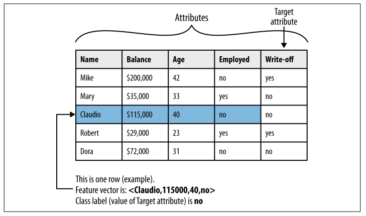

# CH 3 | Introduction to Predictive Modeling: From Correlation to Supervised Segmentation

### Fundamental Concepts

* Identifying informative attributes
* Segmenting data by progressive attribute selection

### Exemplary Techniques

* Finding correlations
* Attribute/variable selection
* Tree induction

### Models, Induction, and Precision

> "Information is a quality that reduces uncertainty."

| Term                  | Description                                   |
| --------------------- | --------------------------------------------- |
| **Model**             | A simplified representation of reality.       |
| **Predictive Model**  | A model for estimating unknown values.        |
| **Descriptive Model** | A model for understanding data.               |
| **Feature**           | Input variables; also called **attributes**.  |
| **Label**             | Output variables.                             |
| **Instance**          | Row; a single data point.                     |
| **Dataset**           | Table; a collection of data points.           |
| **Induction**         | Generalizing specific cases to generic rules. |
| **Deduction**         | Deriving specific facts from generic rules.   |

### Supervised Segmentation

