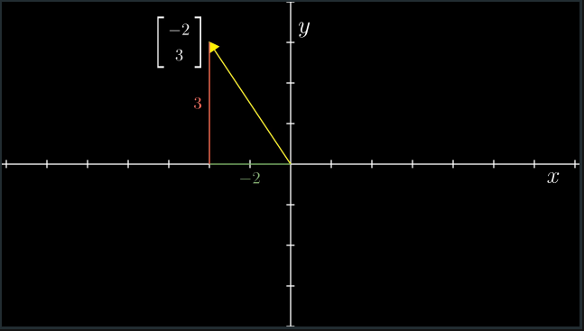
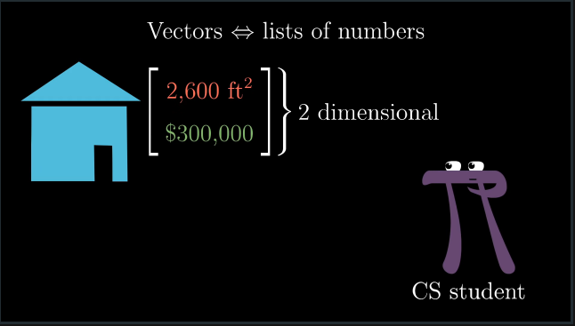

# CH 1 | Vectors

* Vectors can be interpreted through the lens of:
  * Physics (number and magnitude in space)
  * Computer Science (list of numbers with indices)
  * Mathematics (objects that can be operated on)

#### Physics (Geometric)

#### Computer Science (Number List)

#### Mathematics (Operations)

