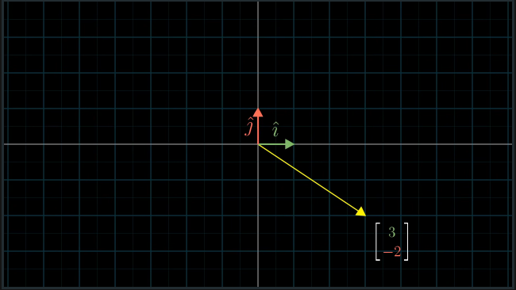
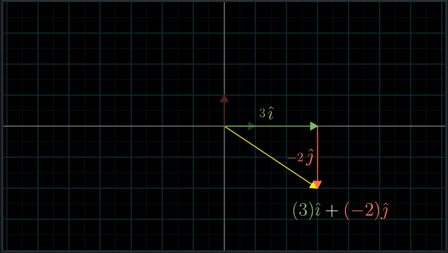
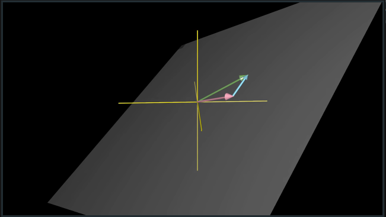
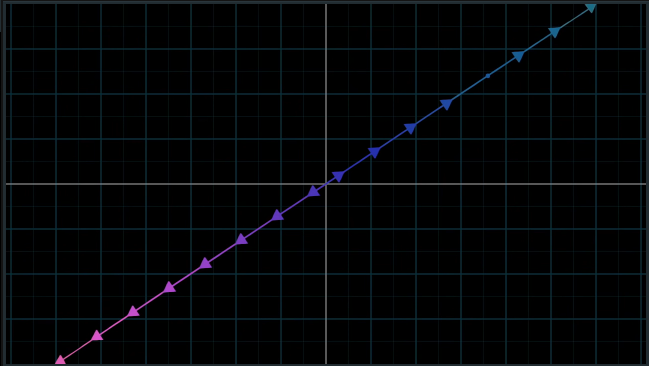
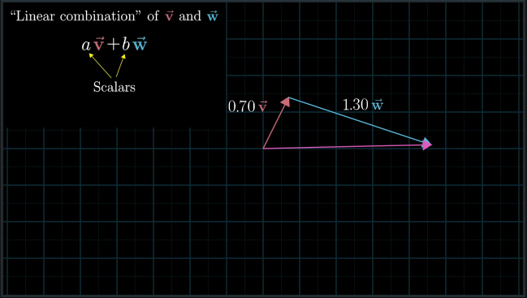

# CH 2 | Span, Basis, and Linear Combinations

#### Basis

* The **Basis Vectors** are like "unit" vectors; they have a value of 1 in a singular direction

* Vectors can be represented as a product of the Basis vectors and some scalars

#### Span

* **Span** represents the possible spaces that a vector can exist in, given that it can be added or scaled

* For most 2D cases, this is a plane of possible values

* However, in the rare case where both vectors overlap (**linearly dependent**), the span is a line

#### Linear Combination

* Any form of scaling and adding vectors

