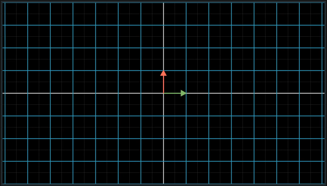
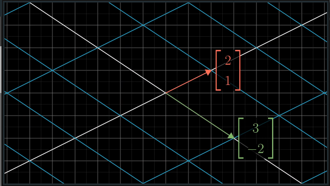
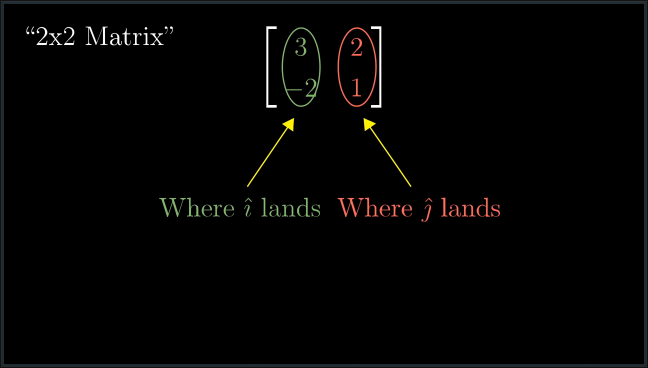
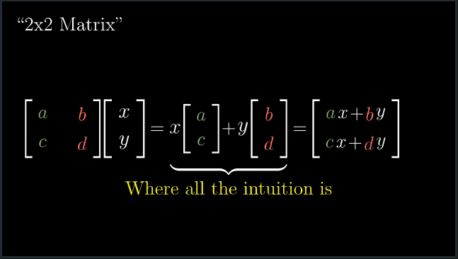

# CH 3 | Linear Transformations and Matrices

#### Linear Transformation

* A function that "moves" an input vector to an output location
  * The origin must stay in place
  * The grid lines must remain linear (i.e. no curling or curving)

| Before | After |
|---|---|
|| |

* Linear transformations are represented as changes to the basis vectors (i and j)

* **Every Matrix can be interpreted as a transformation of space.**