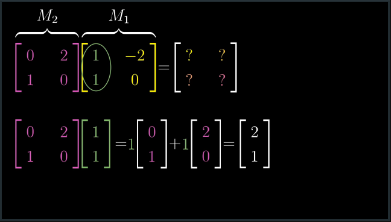

# CH 4 | Matrix multiplication as composition

#### Matrix "Multiplication"

* Matrix multiplication is the process of applying two transformations, one after the other

* We also refer to matrix multiplication as **composition**

#### Algebraic Process

* An abstract example looks like this:

|   |   |
|---|---|
|||

* A practical example looks like this:

|   |   |
|---|---|
|||

* In geometric terms:

    * Basis Matrix

    * Apply M1

    * Apply M2

    * The end product is the "product" or "composition" of M1 and M2

#### Caveat: Not Quite Multiplication

* Unlike normal multiplication, matrix multiplication is **not communative**

* **AB != BA**

* This is because the order of a matrix transformation matters
  * Applying **A** then **B** will produce a different output from applying **B** then **A**

