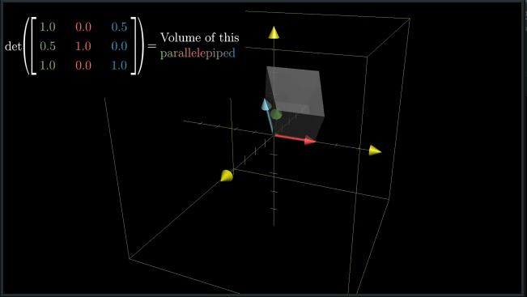

# CH 6 | The Determinant

#### Geometric Interpretation

* The determinant is the scaling factor for an arbitrary chunk of space

|   |   |
|---|---|
|||

* This also applies to three dimensional figures, where **volume** is scaled instead of **area**

|   |   |
|---|---|
|||

* The determinant can be made negative if space is "flipped"

|   |   |
|---|---|
|||

#### Algebraic Interpretation

* Taking the determinant is performed by algebraic calculation, though the derivation and mechanics are relatively unimportant

