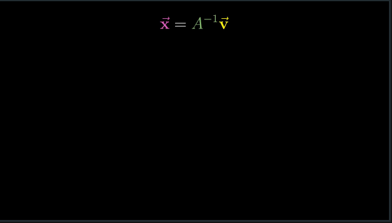

# CH 7 | Inverse matrices, column space and null space

#### Using Matrixes for Great Good

* One of the primary uses of matrixes is solving linear systems of equations (usually through computer programs)

* This often requires the ability to "undo" a matrix by using the **Inverse Matrix**

#### The Inverse Matrix

* So long as the determinant of a matrix is not zero, there is exactly one inverse matrix

|   |   |
|---|---|
|||

* There is no inverse matrix when the determinant of a matrix is zero, as you cannot "unsquish" space

#### Rank and Column Space

* Matrixes can be defined by their **rank**, which represents the number of dimensions the space was compressed into. This is especially helpful for zero determinant matrixes to differentiate levels of squish

|   |   |   |
|---|---|---|
||||

* **Column Space** is the set of all possible outputs for a matrix

* "[Rank] is the number of dimensions in the column space."

#### Null Space

* **Null Space** is the set of vectors that get squished into the origin when a matrix lowers rank

|   |   |
|---|---|
|||
