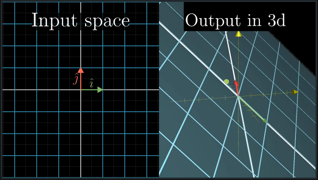
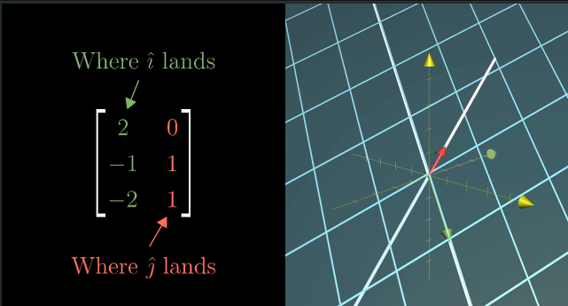
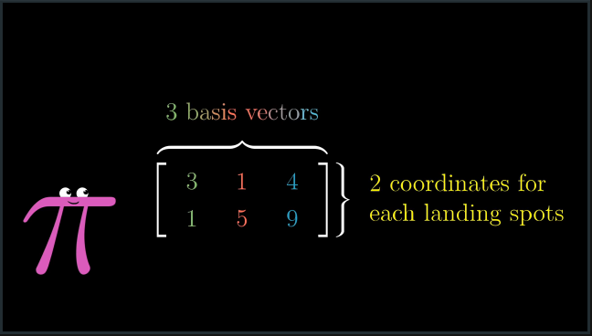
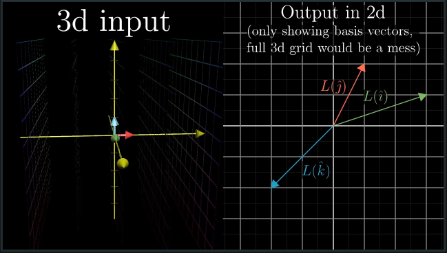

# CH 8 | Nonsquare matrices as transformations between dimensions

#### Nonsquare Matrix

* A nonsquare matrix represents a transformation that changes dimensions (i.e. 3D to 2D or vice versa)

* For example, a 2D matrix can occupy a plane in 3D space other than the usual x/y plane 

* Likewise, a 3D matrix has all three basis vectors, but only moves on a 2D plane

