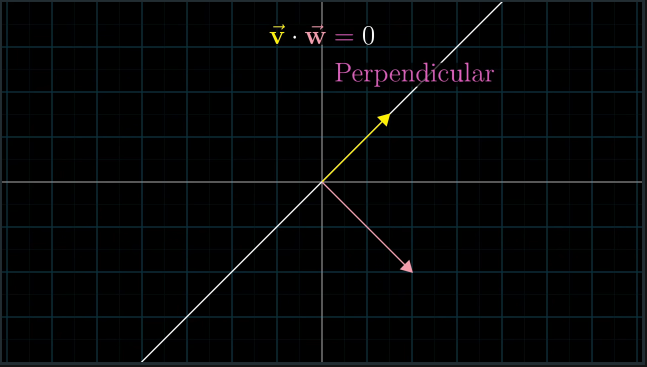

# CH 9 | Dot products and duality

#### Dot Product

* Demonstrates a relationship between two vector's directions

|   |   |   |
|---|---|---|
| |  |  |

* Represents an algebraic operation that **converts a vector to a scalar**

* **Projects** a vector onto another vector by flattening it out along

#### Duality

* Finding an unexpected pattern between two things

*Notetaker's Postscript: I don't believe I understood this section properly. It's still unclear to me where, specifically, duality was evidenced, and what deeper meaning the dot product is supposed to hold. Hopefully the next section sheds some light on the matter.*