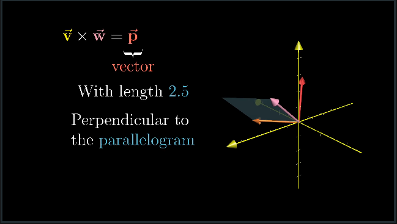
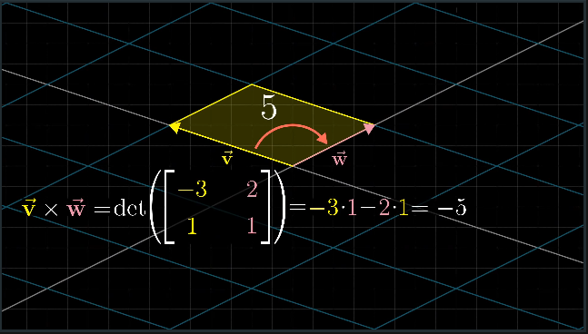
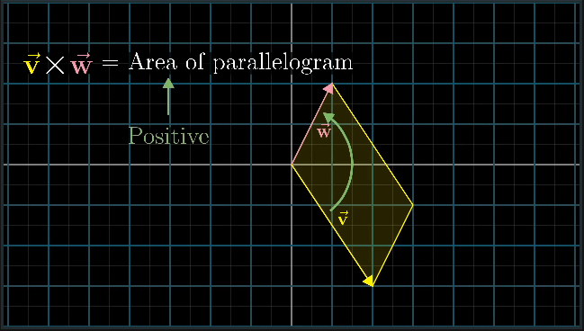
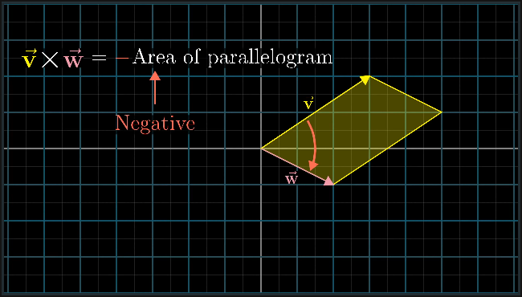
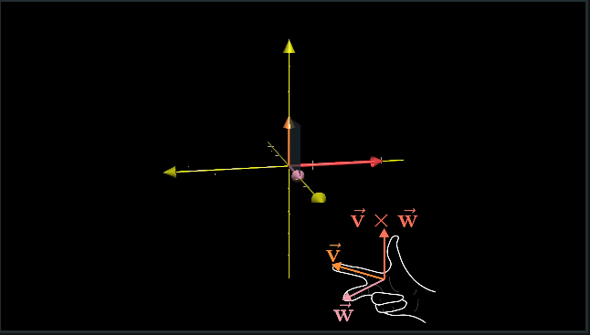
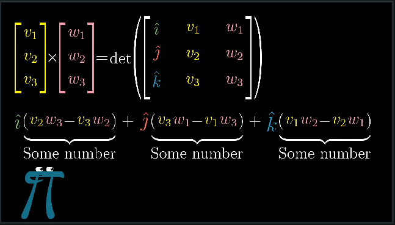

# CH 9 | Cross Products

#### Cross Product

* An operation between two vectors that generates a third vector

* The third vector's magnitude is determined by the area (read: Determinant) of the two vectors

* The sign of the cross product is determined by the ordering of vectors (non-communative)

|   |   |
|---|---|
| |  |

* The **Right Hand Rule** can be used to determine the direction of the cross product

* The algebraic calculation looks like this:

#### Cross Product Intuition

* The cross product is effectively a compression from 3D space to a number line

* The "i j k" vector used in the algebraic equation for cross products is effectively an "x y z" function